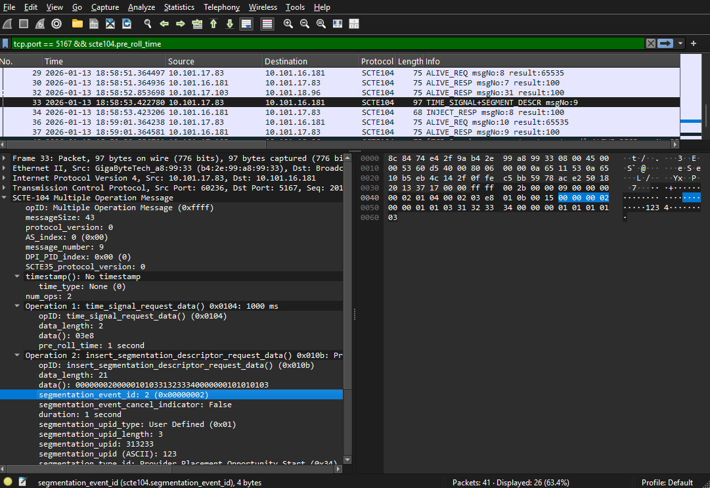

# Wireshark SCTE Dissectors

Wireshark/TShark Lua dissectors for SCTE (Society of Cable Telecommunications Engineers) protocols.

## Supported Protocols

- **SCTE-104** (2023) - Automation System to Compression System Communications over TCP
- Additional SCTE protocols coming soon

## Features



- Full SCTE-104 message dissection including:
  - Init and alive messages
  - Splice requests with SCTE-35 descriptors
  - Time signal requests
  - Segmentation descriptors with all UPID types
  - Detailed bit-level field breakdown
- Human-readable timestamps (UTC with microseconds)
- Comprehensive value-to-name mappings for all operation codes and types
- Compatible with Wireshark 3.x and 4.x

## Installation

### Windows

**One-line install (PowerShell):**
```powershell
mkdir "$env:APPDATA\Wireshark\plugins" -Force | Out-Null; iwr https://github.com/m1tk4/wireshark-scte/releases/latest/download/scte104.lua -OutFile "$env:APPDATA\Wireshark\plugins\scte104.lua"
```

**Manual install:**
1. Download [scte104.lua](https://github.com/m1tk4/wireshark-scte/releases/latest/download/scte104.lua)
2. Copy to `%APPDATA%\Wireshark\plugins\` (typically `C:\Users\YourName\AppData\Roaming\Wireshark\plugins\`)
3. Restart Wireshark

### macOS

**One-line install (Terminal):**
```bash
mkdir -p ~/.local/lib/wireshark/plugins && curl -L https://github.com/m1tk4/wireshark-scte/releases/latest/download/scte104.lua -o ~/.local/lib/wireshark/plugins/scte104.lua
```

**Manual install:**
1. Download [scte104.lua](https://github.com/m1tk4/wireshark-scte/releases/latest/download/scte104.lua)
2. Copy to `~/.local/lib/wireshark/plugins/`
3. Restart Wireshark

### Linux

**One-line install (bash/zsh):**
```bash
mkdir -p ~/.local/lib/wireshark/plugins && curl -L https://github.com/m1tk4/wireshark-scte/releases/latest/download/scte104.lua -o ~/.local/lib/wireshark/plugins/scte104.lua
```

**Manual install:**
1. Download [scte104.lua](https://github.com/m1tk4/wireshark-scte/releases/latest/download/scte104.lua)
2. Copy to `~/.local/lib/wireshark/plugins/` or `/usr/lib/wireshark/plugins/`
3. Restart Wireshark

## Usage

Once installed, the dissector automatically decodes SCTE-104 traffic on TCP port 5167. To capture or analyze:

1. Start Wireshark and capture traffic on the network interface
2. Apply display filter: `scte104`
3. SCTE-104 messages will be automatically dissected and displayed

**TShark usage:**
```bash
tshark -r capture.pcap -Y scte104 -O scte104
```

## Verification

To verify the plugin is loaded:
1. Open Wireshark
2. Go to **Help → About Wireshark → Plugins**
3. Search for "scte104" - you should see it listed

Or check from command line:
```bash
tshark -G plugins | grep scte104
```

## Development

This project includes a complete test infrastructure using Node.js and Mocha:

```bash
npm install
npm test                          # Run all tests
npm run watch-sample <file>       # Watch mode for development
npm run update-expected <file>    # Update expected test outputs
npm run wireshark                 # Launch Wireshark with all plugins
```

## Standards

- [ANSI/SCTE 104 2023](https://www.scte.org/standards/library/catalog/ansi-scte-104-automation-to-compression-communications-api/) - Automation System to Compression System Communications API
- [ANSI/SCTE 35 2023r1](https://www.scte.org/standards/library/catalog/ansi-scte-35-digital-program-insertion-cueing-message/) - Digital Program Insertion Cueing Message

## License

MIT License - see [LICENSE](LICENSE) file for details

## Contributing

Contributions welcome! Please feel free to submit issues or pull requests.